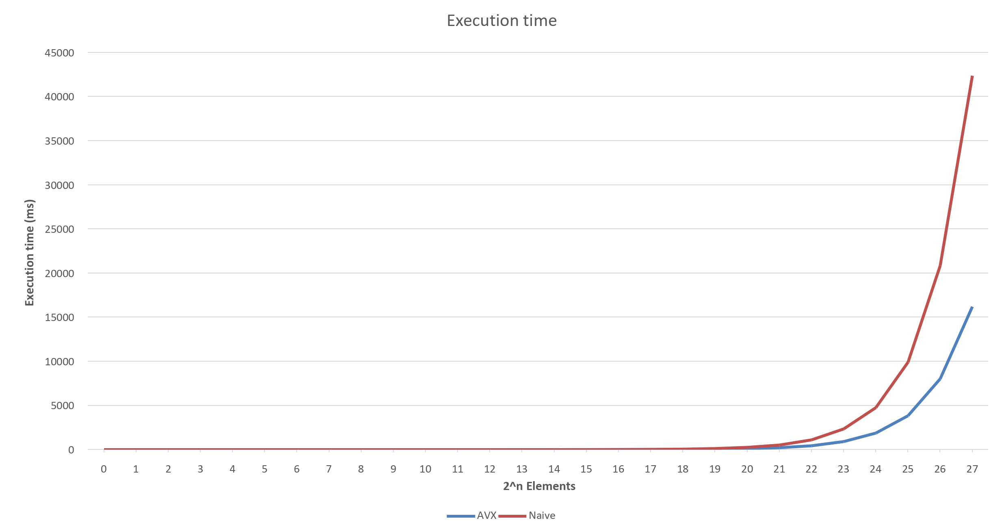
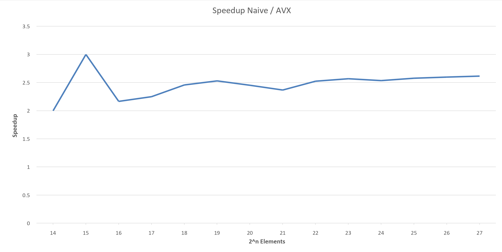

# Quicksort using AVX2
###### Joël Allemann
This is an implementation of the well known [Quicksort](https://en.wikipedia.org/wiki/Quicksort) algorithm, but using [AVX2 extensions](https://en.wikipedia.org/wiki/Advanced_Vector_Extensions#Advanced_Vector_Extensions_2) in C++. This approach is based upon damageboy's blog [this goes to eleven](https://bits.houmus.org/2020-01-28/this-goes-to-eleven-pt1).  
It was made as assignment 2 of the [pac (parallel computing)](https://www.fhnw.ch/de/studium/module/9390145) module at FHNW, I however did really enjoy optimizing it.

# Performance
Before you continue reading, let's look at the performance improvements of using AVX. Comparing in to a plain, naive version of quicksort, a mean speedup of over **2.4** can be reached in debug mode.

<div style="display: flex;">
    
    
</div>

For problem sets with less than $2^{14}$ elements, no big difference is noticeable. From there on, a speedup is measureable.

# Explanation
To make use of AVX in quicksort, a first division of problem sets has to be made. Since quicksort uses the principle of divide and conquer, each iteration results in a (in size) smaller problem set of the one that was processed before.

```c++
void QuickSort::qSortAVX(std::vector<int>& a, int64_t beg, int64_t end)
{
  int64_t len = end - beg + 1;
  if (len > 16) {
    int64_t bound = (size_t)(VecotrizedPartition(&a[beg], &a[end]) - &a[0]);
    qSortAVX(a, beg, bound - 1); // sort left side
    qSortAVX(a, bound + 1, end); // sort right side
  } else if (len > 1) {
    insertionSort(a, beg, end);
  }
}
```

- When entering the sort method, every problem set with a size smaller than 1 will be ignored. (since an array of 1 element or less is always sorted) 
- Problem sets with less or equal to 16 elements are sorted with an implementation of the insertion sort.
- All other problem sets are processed by the `VectorizedPartition` method. This is where all the AVX (and some more) magic happens.

The `VectorizedPartition` method returns a pointer to an element. This is the pivot element which was used for that sorting iteration. This element is then converted into an index (it does that by taking the address of the pivot element, and subtracting the "base" address of the original vector) to call the sorting method for the left and right side. Since the pivot elements will always be in the correct place of the array, it is skipped for further iterations.

## AVX magic
The `VectorizedPartition` takes two pointers. One which points to the element far left of the sorting range, and one pointing to the far right of the sorting range.

```c++
int piv = *right;
__m256i P = _mm256_set1_epi32(piv);
```
The most right element is also used as pivot element.
We also broadcast the pivot element in a 256-Bit avx variable. It is later used for comparing the elements of the problem set.

```c++
void AvxPartition(int* origData, int*& writeLeft, int*& writeRight, __m256i& pivotVector) {
  // 1
  __m256i data = _mm256_loadu_si256((__m256i*)(origData));
  // 2
  __m256i compared = _mm256_cmpgt_epi32(data, pivotVector);
  int mask = _mm256_movemask_ps(*(__m256*)&compared);
  // 3
  data = _mm256_permutevar8x32_epi32(data, _mm256_loadu_si256((__m256i*)PermLookupTable32Bit::permTable[mask]));
  // 4
  _mm256_storeu_si256((__m256i*)writeLeft,  data);
  _mm256_storeu_si256((__m256i*)writeRight, data);
  // 5
  int nLargerPivot = _mm_popcnt_u32(mask);
  writeRight -= nLargerPivot;
  writeLeft  += 8 - nLargerPivot;
}
```

All other AVX operations are done in a function. Three pointers and the pivot vector are passed to that function. The first pointer points to the data we will read. The `writeLeft` and `writeRight` pointers point to where the data is stored to. All values > pivot are written to *right*, whereas all values <= pivot are written to `left`.
Since AVX2 is able to process 256 bit variables, but only ints (32 bit) are processed, 8 elements can be processed at once.
1. Load the data that needs to be sorted in a 256 bit variable (or better said, eight 32 bit values packed by eachother)
2. Create a mask that is used to move the elements to the right position. Firstly, an intrinsic compares the elements if it is **g**reater **t**han (cmp**gt**) the pivot element. The intrinsic returns another boxed 256-Bit variable, where each element greater than pivot is 32x one, and all others are 32x zero. The `movemask` intrinsic creates a byte from that, where each bit represents the comparsion of the respective element at that position.

    |Pivot = 12|5|6|44|56|1|22|3|4|
    |-|-|-|-|-|-|-|-|-|
    |`cmpgt`|0..0|0..0|1..1|1..1|0..0|1..1|0..0|0..0|
    |`movemask`|0|0|1|1|0|1|0|0|

3. Move the elements so all elements > pivot are on the right and all elements <= pivot are on the left. This is also called permutation and it is implemented with a lookup table, which conveniently returns a respective permutation for each mask. Understanding permutation is quite easy - imagine the eight 32 bit boxed elements have an index. Those indexes can be swapped with the `permutevar` intrinsic. When the mask looks like `0b10101010`, and the goal is to have the elements sorted in a way that would return `0b00001111` with above intrinsics, elements 7, 5, 3 and 1 must be moved. This means, the indexes for the permutation could be `0 2 4 6 1 3 5 7`, so element zero stays where it is, element one is moved to the fifth position, second element to the second etc. 
4. Finally, the data is stored to both sides. Always all eight elements are written to each side.
5. Since not all elements belong to each side, the pointer of the writer has to be adjusted by the elements that are actually on the right position. If for example three elements belong to the left side, the pointer is advanced by three addresses, and the "faulty" values are then overwritten. For that to work, a handy intrinsic `popcnt` can be used. It counts the amount of ones in a variable, and returns that value. 

For this all to work, additional space on the problem set is needed, so "faulty" data can be written to it without destroying yet unread data. Per run through this function, at least eight elements are written incorrectly. Since it is not clear where exactly those eight elements will be, both sides need eight elements of spare place.

```c++
// Prepare the tmp array
int tmpArray[24];
int* const tmpStart = &tmpArray[0];
int* const tmpEnd = &tmpArray[24];
int* tmpLeft = tmpStart;
int* tmpRight = tmpEnd - intIn256;

AvxPartition(left            , tmpLeft, tmpRight, P);
AvxPartition(right - intIn256, tmpLeft, tmpRight, P);
tmpRight += intIn256;
```

To resolve this, the so called `tmpArray` is used. It stores the first and last eight elements sorted (by quicksort definition) inside of it. To do that, the first partition opereration is not written back to the problemset, but in the temporary array.

```c++
int* writeLeft  = left;
int* writeRight = right - intIn256;
int* readLeft   = left + intIn256;
int* readRight  = right - 2 * intIn256;
```

Here, some pointers are created. Each side has a `read` and a `write` pointer. Reading means, reading original data and throwing them into AVX to sort it, and write to write the data back to the problem set. Keep in mind that the right side always has to be offset to the left by eight, because the writeback of the `AvxPartition` function always writes all eight elements. (but advances the write pointer only by n valid elements)  

```c++
while (readRight >= readLeft) {
  int* nextPtr;
  if ((readLeft - writeLeft) <= (writeRight - readRight)) {
    nextPtr = readLeft;
    readLeft += intIn256;
  } else {
    nextPtr = readRight;
    readRight -= intIn256;
  }
  AvxPartition(nextPtr, writeLeft, writeRight, P);
}
```
After initial space is made, the party can be started. As long as there is still unread data on the problem set, it is read from one side and the pushed into the `AvxPartition` method. Using the tmpArray and the if clause, we created a small but very important invariant - between `readX` and `writeX` are, at point of the AVX Partition process, at least eight elements. If one side would have less than eight elements, unread data would be overwritten and data would get lost.
This is done as long as there are more than eight elements between the left and right side. If there are less, they can't be handled with AVX anymore (or better said they could be, but it would not help with any performance gain).

```c++
for (readLeft; readLeft < readRight + intIn256; readLeft++){
  *readLeft <= piv ? *tmpLeft++ = *readLeft : *--tmpRight = *readLeft;
}
```
The last elements are stored sequencially. Mind to add the offset of `intIn256` back to readRight, since now all data inbetween is now imporant.
Elements which are smaller or equal to the pivot element are added to the left side of the **tmpArray**, all others to the right.

```c++
size_t leftTmpSize = tmpLeft - tmpStart;
memcpy(writeLeft, tmpStart, leftTmpSize * sizeof(int));
writeLeft += leftTmpSize;
size_t rightTmpSize = tmpEnd - tmpRight;
memcpy(writeLeft, tmpRight, rightTmpSize * sizeof(int));
```

Now it's time to push the data from the tmpArray back to the problem set. First the amount of elements <= pivot are calculated and added, then the amount of elements > pivot. The `writeLeft` pointer is advanced by the left side - because this is where the pivot element has to be inserted.

```c++
*right = *writeLeft;
*writeLeft = piv;
```

The last element from the problem set is swapped with the element at the `writeLeft` pointer. Since the elements > pivot were injected there, one element greater than the pivot is swapped with the pivot element and the invariant of the quicksort holds.

# Limitations
1. Only 32 bit, signed integers can be sorted
2. The code is designed rather unsafe, with tons of pointers.
3. Currently, the pivot element is determined by the last element in the current problem set. While this is really fast, it could result in a worst-case ($O(n^2)$) faster.